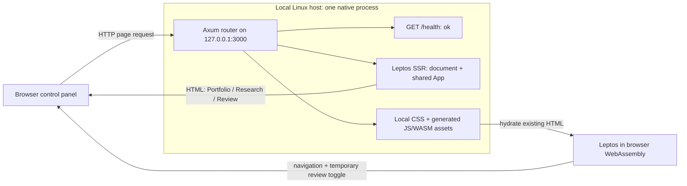

# Stage 01 — one process, one browser, three pages

## Purpose

Establish a working Linux application and understand its server/browser boundary
before adding investment logic. This stage answers: how does Rust become both
an HTTP server and an interactive page, and which side will own data access?

Axum owns the HTTP listener. Leptos renders the first HTML on the server, then
hydrates that HTML in the browser using WebAssembly compiled from the same UI.
All examples are deliberately fictional. No account files are opened.

### Schwab Tracker
- **README and dependencies:** Windows-oriented launcher; Rust 2021 with Axum
  0.7, Tokio 1.38, tower-http 0.5, Serde/JSON, csv 1.3, Chrono, and tracing.
  Plain HTML/CSS/JavaScript uses external visual libraries; there is no Leptos.
- **Source layout:** `src/main.rs` wires the server; `handlers.rs` loads and
  serves a dataset; `parser.rs` recognizes exports; `models.rs` holds data
  structures; `analytics.rs` computes summaries. `static/` holds the UI and
  benchmark cache, with Windows launch/refresh scripts at the root.
- **Models:** `Position`, `RealizedTrade`, `Transaction`, `BalanceInfo`,
  `FullDataset`, `OverviewStats`, `TradingStyleProfile`, `EquityCurvePoint`,
  `DataQuality`, and exposure/sector summaries. Monetary values currently use
  `f64`; review decimal representation and missing-value semantics before reuse.
- **Routes:** GET `/api/all`, `/api/overview`, `/api/style`, `/api/equity_curve`,
  `/api/positions`, `/api/balances`, `/api/tickers`, `/api/trades`,
  `/api/transactions`; POST `/api/reload`; static-file fallback.
- **Persistence:** original CSVs on disk, latest recognized file per type chosen
  by modification time, derived `FullDataset` under `Arc`/`RwLock` in memory.
  Planned-risk notes use browser local storage; imported daily account history
  is page-local. There is no database. Reload replaces the in-memory dataset.
- **Worth carrying forward:** positions and signed exposures; source filenames
  and missing-input notes; tax-lot versus grouped-setup analysis; explicit
  distinction between realized P&L and total account return; SHV as cash
  equivalents; trading review, concentration, and benchmark comparisons.
- **Revisit when importing:** parsers can silently map invalid/missing numbers
  to zero and skip malformed rows. Preserve provenance and report validation
  errors before trusting performance calculations. Do not port this behavior
  blindly, or make browser local storage the source of truth for review notes.

### ConsensX
- **README and dependencies:** a Rust 2024 workspace with `server` and `client`.
  Server: Axum 0.8.9, SQLx 0.9/SQLite, Reqwest 0.13.5, Tokio, Serde, Chrono,
  tower-http, tracing, and token comparison via subtle. Client: Leptos 0.8.20
  with `csr`, gloo-net, gloo-timers, Serde, wasm-bindgen; Trunk bundles assets.
- **Source layout:** server `main.rs` contains routes/configuration/ingestion,
  `db.rs` contains models and persistence, `market.rs` adapts public sources.
  Client `lib.rs` contains rendering, API access, search, and polling.
- **Models:** `Company`, `CompanySnapshot`, `Briefing`, `Source`, and
  `UpsertOutcome`. Briefings distinguish issuer guidance from consensus and
  carry reporting periods, market as-of dates, analyst actions, and source URLs.
  The client repeats several server response types, suggesting a future shared
  contract once this workbench actually needs one.
- **Routes:** GET `/api/companies`, `/api/config`, `/api/health`;
  POST `/api/admin/ingest`; DELETE `/api/admin/companies/{symbol}`;
  static-file fallback. Company responses support ETags/304.
- **Persistence:** SQLite via SQLx in WAL mode; `company_data` stores current
  briefings and `earnings_history` stores JSON snapshots unique by company and
  earnings period. `app_migrations` tracks initial seeding. Same-period ingests
  remain unchanged, so future correction/versioning policy needs an explicit
  decision before adopting that immutability rule.
- **Refresh:** server tasks check a public source or custom feed; failures retain
  saved snapshots. The browser polls local API/config endpoints. This is CSR,
  not SSR + hydration.
- **Worth carrying forward:** server-owned retrieval, dated snapshots, source
  links, visible freshness, guidance/consensus separation, and retention of the
  last good snapshot when a source fails.

## Current skeleton



There is no database, domain service, import workflow, or external data request
in this diagram because none exists yet. The only state is temporary UI state.

```text
epic-platform/              # local checkout
├── Cargo.toml              # single-member workspace, two build features
├── Cargo.lock              # resolved dependency versions
├── README.md               # Linux / fish commands
├── src/
│   ├── main.rs             # native process startup and shutdown
│   ├── server.rs           # Axum routes; compiled only with ssr
│   ├── lib.rs              # shared modules and browser hydration entry
│   ├── app.rs              # document shell, navigation, page routing
│   └── pages/
│       ├── mod.rs
│       ├── portfolio.rs    # fictional positions
│       ├── research.rs     # sample briefing
│       └── review.rs       # disposable interactive prompt
├── style/main.css          # local responsive styles, system fonts
└── docs/architecture-stage-01.md
```

`target/` is generated and ignored: native executable, WASM artifacts,
`site/pkg/` browser assets, and the project-local cargo-leptos installation.

## Why this shape

One application package is enough for three pages. The workspace gives future
crates a home, but creating empty domain crates now would add manifests and
interfaces before there are real behaviors to separate.

`ssr` enables Axum, Tokio, and Leptos server rendering. `hydrate` enables the
browser entry point and Leptos hydration. cargo-leptos builds the native binary
and WASM library separately; do not enable both with `--all-features`.
Native-only dependencies cannot enter the browser's normal hydrate build.

For a direct `/research` request, Axum matches a route generated from `App`,
renders `shell` and the Research page into HTML, and returns it. The browser
then loads locally served generated JavaScript glue and WASM. `hydrate()`
attaches Rust event handlers/reactivity to the existing HTML. Subsequent tab
navigation is handled by Leptos; direct reloads still work through Axum SSR.
The page contents and ordinary navigation also work without JavaScript.

The Review toggle is only a demonstration of hydration. It resets on route
change/reload, performs no workflow, and writes no storage. `/health` reports
process liveness only, not database or data-source readiness.

The integration follows the [official Axum starter](https://github.com/leptos-rs/start-axum).
Generated wasm-bindgen glue and development reload code are the only JavaScript;
application logic remains Rust. One origin also avoids a separate frontend
server, cross-origin API configuration, or a deployment orchestrator.

Build tooling is pinned to cargo-leptos 0.3.5 and wasm-bindgen CLI 0.2.128.
The latter must match the exact wasm-bindgen crate version. Tools install under
this checkout's ignored `target/tools/`, keeping existing project tools intact.
Cargo.lock and the manifest's `--locked` build arguments preserve the dependency
resolution used here. Both builds use stable Rust; no nightly features are needed.

## Intended future modules (not implemented)

| Module | Responsibility | Boundary |
| --- | --- | --- |
| `portfolio` | Validated import records, positions, transactions, lots, performance calculations | Parsing/calculations separate from HTTP and UI; server owns file access |
| `research` | Companies, earnings snapshots, source links, freshness, provider adapters | Server makes external requests and stores snapshots |
| `workflows` | User-triggered import/refresh/review operations and their results | Coordinates domain modules; future jobs stay server-side |
| `shared` types | Only contracts genuinely needed on both sides: IDs, summaries, errors | Pure Rust data, with no database clients, file handles, or secrets |

Start these as modules when their first feature arrives; extract crates only
when dependency isolation or reuse warrants it. Review is a user-facing page,
not a reason to create a separate service. Later, SQLite belongs behind the
server boundary. The browser will send commands and display results; Axum will
own data access, imports, workflows, secrets, and eventual background jobs.

## Deliberately out of scope

- Schwab CSV discovery/import or reading `/home/dylan/schwab-data`.
- ConsensX retrieval, real financial calculations, charts, benchmarks, and feeds.
- Authentication, SQLite, migrations, or durable/browser-local persistence.
- Scheduling, background jobs, AI features, queues, and workflow engines.
- Deployment automation, containers, remote hosting, and multiple services.
- Premature domain schemas, repository traits, and generic plugin abstractions.

These concerns introduce independent failure modes and decisions. First prove
the build, request routing, rendering, and browser interaction with no data
side effects. This keeps the learning step small and its result observable.

## What to inspect personally

1. Read Cargo's `ssr` and `hydrate` features and find the matching `cfg` in
   `lib.rs`. Explain to yourself why Tokio is absent from the browser build.
2. Trace `main.rs` → `server::router` → `app::shell` → `App` → one page.
3. Use View Page Source on `/research`: its heading/content already exists
   before WASM runs. Disable JavaScript and reload to confirm SSR.
4. Re-enable JavaScript, open Review, and toggle its prompt. Find the
   `RwSignal` and `on:click` in `review.rs`. Observe local `.js`/`.wasm`
   requests in browser developer tools and navigation without document reloads.
5. Open each page directly, use back/forward, and request `/health` with curl.
   Visit an unknown URL to see the 404 page. Edit page copy with the watcher
   running and observe the rebuild.

## Single best next feature

Build a **manual Schwab positions CSV preview**. One user action asks the
server to read one selected local positions export from the configured data
directory, parse it into a small typed result, and show rows plus validation
errors and source provenance. Keep it read-only and in memory initially.

This adds the first useful vertical slice: browser command → server-owned
file access → pure parser → typed response → UI. Use explicit decimal and
missing-value handling rather than copying permissive numeric parsing. Leave
multiple export formats, performance analytics, SQLite, and scheduling for
later stages. It earns the first `portfolio` module with a concrete need.

## Stage 1 verification

Verified on Linux with rustc 1.94.1, cargo-leptos 0.3.5, and wasm-bindgen 0.2.128:

- `cargo fmt` check and Clippy with warnings denied, separately for SSR/native
  and hydrate/wasm32 targets.
- Full `cargo leptos build` (native executable, generated JS/WASM, and CSS).
- README's fish `cargo leptos watch` command starts successfully and serves
  the local health endpoint.
- HTTP checks: server-rendered content for all three pages, root redirect,
  `/health` returning `ok`, unknown page and missing asset returning 404,
  and JS/CSS/WASM assets served with the expected content types.
- Headless Firefox: both directions of the Review toggle, all navigation tabs
  without document reload, current-tab state, page titles, browser back/forward,
  direct URLs, and no horizontal page overflow at 390px viewport width.
- Browser console: no warnings or errors during those checks. Desktop layout
  was also visually inspected.

The checks use fictional data only. There are no domain calculations to unit
test yet; the first parser should introduce focused validation tests.
