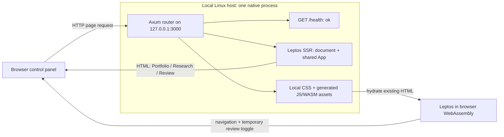

# Stage 01 — one process, one browser, three pages

This document records the Stage 1 baseline. [Stage 3](architecture-stage-03.md)
now implements research as an internal module in the same process; ConsensX is
a code reference and never needs to run as a separate EPIC dependency.

## Purpose

Establish a working Linux application and understand its server/browser boundary
before adding investment logic. This stage answers: how does Rust become both
an HTTP server and an interactive page, and which side will own data access?

Axum owns the HTTP listener. Leptos renders the first HTML on the server, then
hydrates that HTML in the browser using WebAssembly compiled from the same UI.
All examples are deliberately fictional. No account files are opened.

## What the reference apps teach us

### Schwab Tracker: turn broker exports into a portfolio story

Schwab Tracker is a local dashboard for Charles Schwab CSV exports. You give it
four kinds of files—positions, balances, transactions, and realized gains/losses.
It reads those files, combines them into one in-memory picture of the account,
then shows portfolio, trading-performance, and behaviour analytics in a browser.

Its code is divided by job:

- `parser.rs` reads the different Schwab CSV layouts.
- `models.rs` names the things in those files, such as a `Position` or
  `RealizedTrade`.
- `analytics.rs` turns raw rows into answers: realized P&L, drawdown, win rate,
  holdings, concentration, and similar summaries.
- `handlers.rs` gives the browser those answers through Axum API routes.

The useful lesson for EPIC Platform is the flow: **broker file → checked data →
calculation → page**. It also makes several valuable distinctions: a tax lot is
not always one investment decision, realized trading P&L is not total account
return, and a source filename or missing export should remain visible to the
user. When we add imports, we will keep those ideas but report bad or missing
values clearly instead of quietly treating them as zero.

### ConsensX: keep research tied to evidence and time

ConsensX is a local company-research dashboard. Its server collects or accepts
company earnings information, saves the latest briefing and prior reporting
periods in SQLite, and gives the browser a list of company cards. Each briefing
can include earnings highlights, guidance, analyst consensus, dates, and links
back to sources.

Its code is also divided by job:

- `market.rs` fetches and reshapes outside research data.
- `db.rs` stores companies and earnings snapshots.
- `main.rs` exposes Axum routes and starts refresh work.
- the Leptos client displays the cards and asks the server for updates.

The useful lesson for EPIC Platform is that research should be **dated,
traceable, and server-owned**. A research note is more useful when it says
which earnings period it describes, when it was refreshed, and where its claims
came from. If a refresh fails, the last known good snapshot should remain
available instead of leaving an empty card.

## Current skeleton



There is no database, domain service, import workflow, or external data request
in this diagram because none exists yet. The only state is temporary UI state.

```text
epic-platform/              # local checkout
├── Cargo.toml              # single-member workspace, two build features
├── Cargo.lock              # resolved dependency versions
├── README.md               # Linux / fish commands
├── src/
│   ├── main.rs             # native process startup and shutdown
│   ├── server.rs           # Axum routes; compiled only with ssr
│   ├── lib.rs              # shared modules and browser hydration entry
│   ├── app.rs              # document shell, navigation, page routing
│   └── pages/
│       ├── mod.rs
│       ├── portfolio.rs    # fictional positions
│       ├── research.rs     # sample briefing
│       └── review.rs       # disposable interactive prompt
├── style/main.css          # local responsive styles, system fonts
└── docs/architecture-stage-01.md
```

`target/` is generated and ignored: native executable, WASM artifacts,
`site/pkg/` browser assets, and the project-local cargo-leptos installation.

## Why this shape

- **One local process is enough for now.** Axum owns HTTP, future file access,
  data, secrets, and background work. The browser is the control panel.
- **One set of Rust UI components serves two jobs.** Axum renders the first HTML
  page; the browser then hydrates it with WebAssembly for interactions.
- **Keep the first stage small.** The three pages prove routing, rendering, and
  hydration before imports, a database, or jobs add more concepts to learn.
- **Grow boundaries when a feature needs them.** Future portfolio, research,
  and workflow modules will get real responsibilities before becoming crates or
  services.

## Intended future modules (not implemented)

| Module | Responsibility | Boundary |
| --- | --- | --- |
| `portfolio` | Validated import records, positions, transactions, lots, performance calculations | Parsing/calculations separate from HTTP and UI; server owns file access |
| `research` | Companies, earnings snapshots, source links, freshness, provider adapters | Server makes external requests and stores snapshots |
| `workflows` | User-triggered import/refresh/review operations and their results | Coordinates domain modules; future jobs stay server-side |
| `shared` types | Only contracts genuinely needed on both sides: IDs, summaries, errors | Pure Rust data, with no database clients, file handles, or secrets |

Start these as modules when their first feature arrives; extract crates only
when dependency isolation or reuse warrants it. Review is a user-facing page,
not a reason to create a separate service. Later, SQLite belongs behind the
server boundary. The browser will send commands and display results; Axum will
own data access, imports, workflows, secrets, and eventual background jobs.

## Deliberately out of scope

- Schwab CSV discovery/import or reading `/home/dylan/schwab-data`.
- ConsensX retrieval, real financial calculations, charts, benchmarks, and feeds.
- Authentication, SQLite, migrations, or durable/browser-local persistence.
- Scheduling, background jobs, AI features, queues, and workflow engines.
- Deployment automation, containers, remote hosting, and multiple services.
- Premature domain schemas, repository traits, and generic plugin abstractions.

These concerns introduce independent failure modes and decisions. First prove
the build, request routing, rendering, and browser interaction with no data
side effects. This keeps the learning step small and its result observable.

## Single best next feature

Build a **manual Schwab positions CSV preview**. One user action asks the
server to read one selected local positions export from the configured data
directory, parse it into a small typed result, and show rows plus validation
errors and source provenance. Keep it read-only and in memory initially.

This adds the first useful vertical slice: browser command → server-owned
file access → pure parser → typed response → UI. Use explicit decimal and
missing-value handling rather than copying permissive numeric parsing. Leave
multiple export formats, performance analytics, SQLite, and scheduling for
later stages. It earns the first `portfolio` module with a concrete need.
