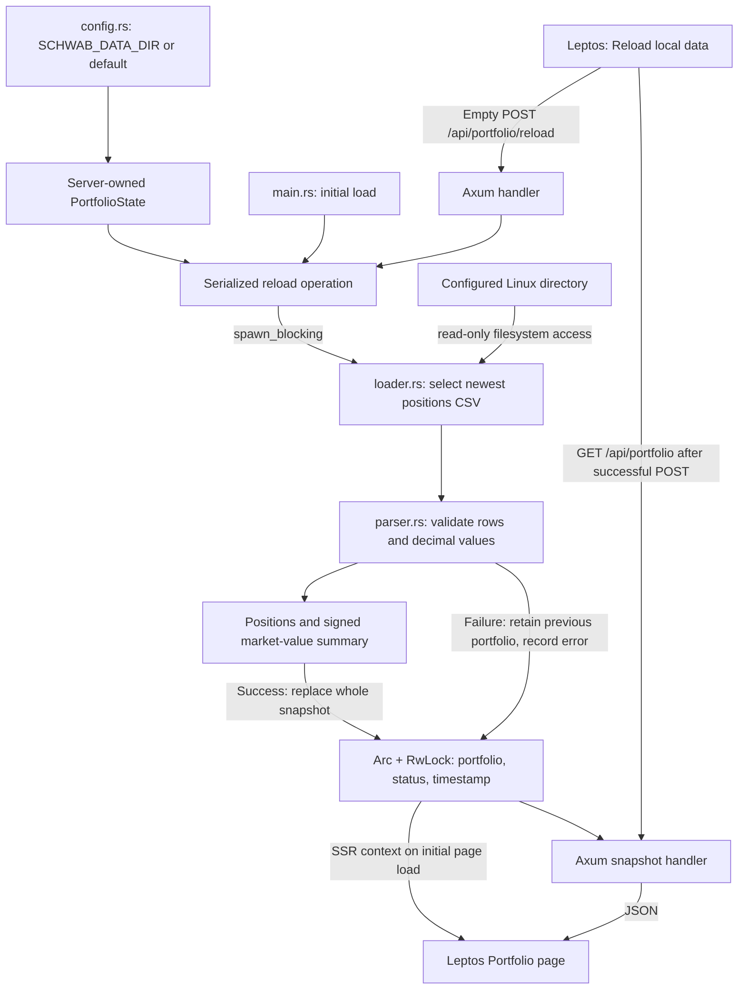

# Stage 02 — local CSVs to live holdings

## Purpose

Add the first working portfolio slice to the existing Stage 1 Axum/Leptos app.
The server reads a configured Linux directory, validates a Schwab positions
export, calculates a small summary, and serves an in-memory snapshot to the UI.
Research and Review retain their Stage 1 placeholder behavior.

## Module responsibilities

| File | Responsibility |
| --- | --- |
| `src/config.rs` | Reads the environment once; defines the sole default data path. |
| `src/main.rs` | Creates state, attempts initial load, starts HTTP even if loading fails. |
| `src/portfolio/mod.rs` | Shared Position, Portfolio, PortfolioSummary, LoadError, LoadStatus and PortfolioSnapshot models. |
| `src/portfolio/loader.rs` | Native filesystem discovery, newest-file selection and UTF-8 reads. |
| `src/portfolio/parser.rs` | Pure CSV-to-domain validation and exact decimal summation. |
| `src/state.rs` | Configuration ownership, safe snapshot access and reload coordination. |
| `src/server.rs` | GET/POST handlers, SSR context, existing routes and static assets. |
| `src/pages/portfolio.rs` | Initial server rendering, browser requests, feedback and holdings table. |
| `tests/portfolio.rs` | Synthetic loader, state preservation and HTTP tests. |

These are modules in the existing crate. No extra crate, repository interface,
database service, or new project is needed.

## Configuration and discovery

`AppConfig::from_env()` in `src/config.rs` reads `SCHWAB_DATA_DIR`. If unset,
the default is `/home/dylan/schwab-data`. An empty override is an invalid path,
not a request to use the default. Relative overrides are relative to the server's
working directory; absolute paths are recommended.

The directory must be readable by the server process. Only regular files directly
inside it are candidates; discovery is not recursive and ignores symlinks.
The filename must contain `position` and end in `.csv`, ignoring case. The newest
modification time wins, with the path as a deterministic tie breaker. An invalid
newest export fails the load; the loader does not silently select an older file.
Use a directory for a single account. Multiple accounts are not merged.

Only positions are required. Balances, transaction and realized gain/loss exports
are ignored in Stage 2. CSV preamble lines and a UTF-8 BOM are supported. The
`Symbol` row identifies the header; named columns accommodate Schwab's expanded
labels such as `Qty (Quantity)` and `Mkt Val (Market Value)`. Required headers
are Symbol, Description, Qty, Price and Mkt Val. Cost Basis and Asset Type are
optional. A malformed holding rejects the complete candidate portfolio.

Quantities and money use `rust_decimal::Decimal` and are serialized as JSON strings.
Currency symbols, thousands separators, negative signs and accounting parentheses
are supported. Missing cost basis stays `null`; missing cash quantity/price stays
`null`. Non-cash holdings require quantity and price; every holding requires a
market value. Invalid numeric text is an error, never zero. Duplicate symbols,
empty exports, missing headers and exports with no holdings are rejected.

The summary sums signed exported market values, including cash rows when present.
It does not multiply quantity by price: option contract multipliers are already
represented in the export's market value. Total rows are not holdings; when an
export supplies a total market value, it must agree with the sum. Cash rows count
in the displayed position count. This is **exported holdings value**, not a promise
of total account equity or a live valuation. No balance cash is added separately.

## Startup and reload

At startup, `main.rs` creates an empty `PortfolioState`, awaits its first reload,
and then starts serving requests. Missing or invalid data records a failed status
and logs the reason; it does not stop the HTTP server. The page can therefore
explain the problem and offer a retry.

Pressing **Reload local data** disables the button while the browser sends an
empty `POST /api/portfolio/reload`. The handler accepts neither a path nor a file.
It invokes the same reload operation as startup. On success the browser requests
`GET /api/portfolio` and replaces the displayed snapshot. A load failure returns
HTTP 422 with the snapshot and structured error; the page displays that error.
Network errors are displayed without removing the existing table.

GET always returns HTTP 200 with the current snapshot, including a failed/unloaded
status if appropriate. POST returns 200 on success and 422 on load failure. Both
use the same JSON shape: `data_directory`, `status`, `last_successful_load`,
`error`, and `portfolio`. The API and page responses use `Cache-Control: no-store`.

Reloads are serialized by a Tokio Mutex. Filesystem reads/parsing use
`spawn_blocking`; they do not hold the snapshot's write lock. An `Arc` shares the
state between requests, while a Tokio RwLock allows snapshots to be cloned under
a read lock. Success publishes the complete new portfolio, UTC RFC 3339 load time,
and status together under one write lock. Failure preserves the previous
portfolio/time and stores an error, so old holdings are explicitly marked stale.
The coordinator runs as a task so an HTTP disconnect does not strand the state
in `loading`. There is no polling or automatic filesystem watching.

The initial Portfolio HTML uses Leptos SSR context to read that same state. A
blocking Resource serializes its result into the page for hydration. Browser
navigation fetches the GET endpoint; browser reload actions use the explicit
POST-then-GET sequence. Other open tabs update when they navigate or reload.

## Filesystem boundary and lifetime

The native server runs as a Linux process with access to its user's files. The
browser runs WebAssembly in a browser sandbox; it cannot open an arbitrary
`/home/dylan/schwab-data` path. It sends HTTP commands and receives parsed data.
The data directory is never registered as a static-file directory. Raw CSVs stay
on Linux; only domain data is returned to the UI. Filesystem modules are compiled
only with the `ssr` feature.

There is no durable state. Restarting discards the previous in-memory portfolio,
status and load timestamp. Startup immediately tries to reconstruct them from
the CSVs. If those files remain valid, holdings reappear with a new load time;
if they are unavailable, the previous snapshot cannot be recovered from memory.

## Reference and architectural decisions

Inspected [Schwab Tracker](https://github.com/dylanchang44/schwab-tracker) at commit
`7cdb9468cebdda649d498b7be2150d638f901aba`, using a separate reference checkout.
The original repository was not modified. Its server uses `SCHWAB_CSV_DIR`
(direct-run default `./schwab_csv`) and its launcher uses a sibling data folder.
EPIC intentionally uses the requested `SCHWAB_DATA_DIR` and Linux default instead.

Discovery conventions, positions fields, cash handling and signed market-value
aggregation are adapted from its parser/models/analytics. The reference recognizes
four report families and permits partial datasets. Stage 2 requires positions
because its goal is holdings, not historical trading analytics. The reference's
account-value fallback sums positions; EPIC labels that measure explicitly.

The reference converts absent or malformed numbers to zero and tolerates skipped
rows/read errors. EPIC rejects invalid candidates and preserves missing optional
values. The reference panics on startup failure; EPIC keeps serving the failure
status. Reference Rust tests cover SHV trading exclusions and allocation; its JS
tests cover trading calculations and helper parsing, not this holdings loader.
EPIC therefore adds focused loader/state/HTTP tests with independently invented
fixtures, including cash, a short option, missing cost basis and exact totals.

Stage 1 proposed a smaller single-file preview as the next step. This stage follows
the requested directory reload and in-memory snapshot instead, retaining the
same one-process, shared-UI architecture. Research and Review remain placeholders.

## Deliberately out of scope

No browser CSV upload or path editor; no database or durable snapshots; no
filesystem watcher, scheduled jobs, live brokerage API, ConsensX integration,
Review workflow, AI analysis, authentication, Docker/cloud deployment, advanced
portfolio analytics, or frontend design-system changes. No automatic account
merging or balance reconciliation.

The best Stage 3 goal is a durable, validated portfolio snapshot history with
source provenance, so the last successful import survives restart and successive
imports can be inspected. That work is not implemented here.

## Verification completed

Stage 1 formatting, native/browser Clippy and the full Leptos build passed before
implementation. The build requires the project-local `target/tools/bin` first on
PATH, as described in README, to use the pinned wasm-bindgen version.

Stage 2 passed formatting, native/browser Clippy with warnings denied, all 11 Rust
tests and a complete Axum + Leptos build. A live server using the synthetic fixture
passed health, startup load, GET, POST and SSR holdings checks. Headless Firefox
confirmed hydration, the reload button's POST-then-GET sequence, timestamp update,
four rendered rows, Research navigation, the Review toggle and navigation back
to Portfolio, without browser errors.

A second live server with a missing directory returned a healthy `/health`, a
failed portfolio status, and an HTTP 200 page explaining the missing directory.
The default local directory was also checked successfully without copying its
exports or recording holdings in this repository. Temporary verification servers
were stopped; the synthetic fixture server was left running for inspection.
