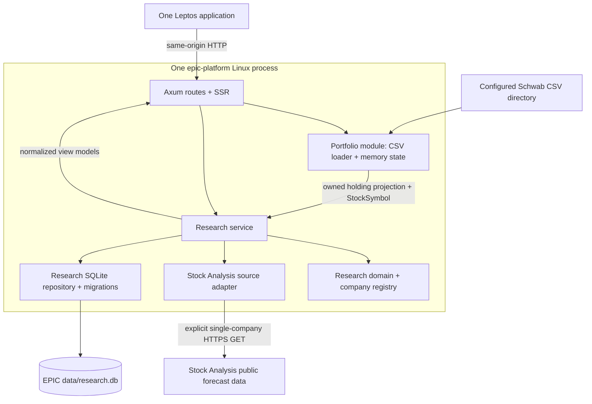

# Stage 03 — research inside a modular monolith

This document records Stage 3. [Stage 4](architecture-stage-04.md) adds immutable
portfolio reviews and supersedes the suggested next-stage goal below. Research
still owns its original database; Review owns a separate database and reads
saved research through a public interface that also exposes snapshot IDs.

## Purpose and boundary

Add the smallest durable research slice to the existing Axum + Leptos app:
holdings -> exact company match -> manual public-source refresh -> immutable
SQLite snapshot -> native Research card. One Rust workspace, one binary, one
Linux process, one listener (127.0.0.1:3000), and one application shell remain.
ConsensX is a reference implementation, not a running dependency. There is no
ConsensX base URL, HTTP service client, iframe, or second application.



Portfolio owns broker parsing, holding classification, monetary position context,
load status and its in-memory lifetime. Research owns public company identity,
source retrieval, validation, earnings snapshots, persistence and refresh errors.
The only shared identity is `StockSymbol`; portfolio and research models remain
in their respective modules. Research receives a minimal `HoldingSummary`
projection, not raw CSV or a mutable portfolio. It never writes holdings.

Module boundaries matter even in one process: a provider's schema change should
affect the source adapter, a storage change the repository, and a page change
the UI. None should force broker parsing to understand those details. No trait,
extra crate, generic plugin system, or second provider abstraction is needed.

## Modules to read

| File | Responsibility |
| --- | --- |
| `src/symbol.rs` | Validated, normalized stock identity and validated Serde input |
| `src/portfolio/mod.rs` | Instrument classification and owned holding projection |
| `src/research/domain.rs` | Registry, period, source link, snapshot, errors and UI/API models |
| `src/research/source.rs` | Native HTTP, bounded reference-table decoding and normalization |
| `src/research/migrations/0001_research.sql` | First versioned research schema |
| `src/research/repository.rs` | Database creation/migration, domain reads and transactional insert |
| `src/research/service.rs` | Exact matches, one refresh at a time, failure/snapshot separation |
| `src/config.rs`, `src/main.rs` | Central path configuration and isolated research initialization |
| `src/state.rs` | Shared application handles and short portfolio projection read |
| `src/server.rs` | Axum routes, HTTP statuses and SSR contexts |
| `src/pages/research.rs` | Native Leptos read/refresh controls and dated research cards |
| `tests/research.rs` | Offline source, SQLite, service and API tests |

## Matching and coverage

`StockSymbol::parse` trims outer whitespace and uppercases ASCII letters. It
accepts 1–16 total characters with at most one dot or dash separating nonempty
letter groups. Dot and dash are not interchangeable (`BRK.B != BRK-B`); `GOOG`
is not an alias for `GOOGL`. Digits, option strings, path syntax and fuzzy company
names are rejected. Serde also validates the type rather than bypassing parsing.

Portfolio additionally checks asset type. Empty (missing), Equity/Equities,
Stock/Stocks and Common Stock permit a candidate; cash, ETFs, options, mutual
funds, bonds and unrecognized nonempty asset types do not. A missing asset type
is not proof of equity identity: exact registry matching is still required.
Cash symbols are excluded even with no asset type. No underlying extraction,
alias conversion, fund expansion, or company-name inference occurs.

The initial registry is the eight symbols in the inspected ConsensX version:
NVDA, MSFT, GOOGL, NET, AMD, ARM, SPCX and MU. A syntactically valid equity outside
it is `unmatched`; a non-equity/invalid instrument is `unsupported`. A registry
match with no snapshot is `never_refreshed`, distinct from `available` and
`repository_failure`. Registry membership is supported coverage, not a promise
that the external website currently has usable data. Unsupported and unmatched
rows remain visible so no holdings disappear silently.

## Request and refresh sequence

Opening `/research` directly uses Leptos SSR to read holdings and saved snapshots;
the Resource result is serialized for hydration. Later browser navigation calls
`GET /api/research/holdings`. Neither path makes an external source request.
The browser only talks to EPIC; source links may open the original publisher in
a new tab. A refresh updates only its card and does not reload other companies.

```mermaid
sequenceDiagram
    actor User
    participant UI as Leptos Research card
    participant API as Axum
    participant Service as Research service
    participant Source as Source adapter
    participant Public as Stock Analysis
    participant Repo as SQLite repository
    User->>UI: Refresh company
    UI->>API: POST /api/research/companies/NVDA/refresh
    API->>Service: refresh(NVDA)
    Service->>Service: Validate symbol + registry; acquire admission flag
    Note over Service: No portfolio lock or SQLite transaction held
    Service->>Source: fetch(company)
    Source->>Public: GET /stocks/nvda/forecast/__data.json
    Public-->>Source: Public SvelteKit reference-table JSON
    Source->>Source: Bound, decode, normalize, validate
    Source-->>Service: ResearchSnapshot or typed source error
    alt valid snapshot
        Service->>Repo: save(snapshot)
        Repo->>Repo: BEGIN; insert if period absent; COMMIT
        Repo-->>Service: inserted / unchanged
    else source failure
        Note over Repo: No write; existing records remain intact
    end
    Service->>Service: Record attempt time/error; release admission flag on return
    Service->>Repo: Read latest saved snapshot
    Repo-->>Service: Domain snapshot
    Service-->>API: outcome + company view + separate refresh error
    API-->>UI: Typed JSON + appropriate HTTP status
    UI-->>User: Update this card; preserve older snapshot on failure
```

One atomic admission flag rejects overlapping company refreshes with HTTP 409;
it does not queue jobs or perform concurrent multi-company retrieval. An RAII
permit releases the flag on completion or cancellation. The page disables all
refresh buttons during its active request, and the server enforces the same rule
across tabs. Ordinary reads remain available. There is no scheduled task, startup
source refresh, retry, polling, or portfolio-triggered fetch.

## External response versus domain model

The public source returns SvelteKit `nodes`, each containing a devalue reference
table. Object/array integers are indexes; literal numbers at indexed entries are
facts. ConsensX's decoder resolves this as data without evaluating JavaScript.
The adapter caps the response at 2 MB and expansion at depth 40 / 50,000 nodes.

`normalize_response` selects `estimates.table.quarterly.lastDate`, then reads
`dates`, `fiscalYear`, `fiscalQuarter`, `revenue`, and `eps` at that index. As in
ConsensX, `trust.lastUpdated` supplies provider time and `priceTargets.currency`
must be USD. The forecast page is the retained source link. No overview fetch,
ratings/targets interpretation, guidance overlay, or generated recommendation is
needed for this slice. Company identity comes from the requested registry entry.

The external model is provider-specific `serde_json::Value` used only in the
adapter; it is not a public application contract. The internal snapshot contains
Company, EarningsPeriod, decimal revenue/EPS, currency, source time, retrieval
time and SourceLinks. Missing values, `[PRO]`, invalid references, future reported
periods, invalid quarters/dates, missing timestamps or non-USD data are rejected.
Numbers never silently become zero. `CompanyView` adds local availability and
attempt errors; the UI never receives SQLite row IDs or provider reference tables.

Provider time is not asserted to be earnings publication time. Retrieval time
records the request that first produced the saved period; a later check of the
same period does not relabel old facts as newly retrieved. Last refresh attempt
time is shown separately and exists only in this process. Source URLs and facts
remain together through serialization, storage, reads and UI rendering.

## Database ownership, migration and transactions

`RESEARCH_DB_PATH` is read once by AppConfig; its sole default is
`data/research.db` relative to the process working directory. An explicit absolute
path is recommended when launching elsewhere. SQLite, HTTP, filesystem and
configuration dependencies are `ssr`-only; the WASM client compiles shared domain
and UI code only. There are no required credentials or research-source settings.

The repository creates parent directories and opens SQLite with WAL, bounded
busy/acquisition waits and SQLx's versioned migration runner. `_sqlx_migrations`
tracks successful versions/checksums. `build.rs` makes migration changes rebuild
the embedded migrations. Failure is logged with its cause and exposed as a typed
initialization or migration error; it does not prevent the web server starting.
Fixing initialization/migration failures requires restarting EPIC. Never edit an
already applied migration; add a new version.

Only `research_snapshots` is needed. The small static registry does not need a
mutable company table yet. Each record stores symbol, earnings-period label,
sortable period-end date, retrieval date and normalized snapshot JSON. Unique
constraints on `(symbol, earnings_period)` and `(symbol, period_end)` prevent
same-period replacement. No brokerage account identifiers, quantities, market
values, CSV contents or complete portfolio are written.

The transaction begins in `repository::save` **after** network retrieval,
normalization and validation. It inserts the entire snapshot with
`ON CONFLICT DO NOTHING`, then commits before reporting success. A failed insert
or commit does not remove existing history. Same-period corrections are
deliberately not supported; they need a future explicit revision policy.

Latest reads order by `period_end DESC`, not insert/retrieval time. New periods
append history; an older response can be retained as a historical record without
downgrading the latest view. The repository's history query returns all periods;
a history UI/endpoint is deferred. Restart preserves snapshots, while last-attempt
metadata resets. The new database is independent of ConsensX's database; importing
its old data requires a separate migration tool and is deferred.

## Locks, timeouts and failures

`PortfolioState::research_input` copies only status and required holding fields
under a read lock. It returns owned values and drops the guard before service
calls to SQLite. Refresh does not access portfolio state at all. Attempt metadata
is likewise copied under a short lock, then the guard is dropped. Slow database
or external network operations must not prevent portfolio readers or a reload's
write lock from progressing. Tests pause the source response while portfolio
reads/reload and research reads complete.

The source request has a 25-second timeout including body reads, with no retries
or redirects. Connection errors, non-success status, timeout, malformed data,
initialization/migration and repository failures are distinct typed errors.
Detailed storage errors stay in server logs; API errors are understandable and
do not dump filesystem paths, SQL queries or arbitrary upstream bodies.

| Case | Behavior |
| --- | --- |
| Missing research DB | Create database/directories, apply migration, show never refreshed |
| Bad path / migration | Research error; Portfolio, Review and health continue |
| No loaded portfolio | Explain how to load Schwab data; no source request |
| Unmatched / unsupported | Visible per-row status; no refresh button or source request |
| Source unavailable / timeout / malformed | Refresh error; older saved snapshot remains readable |
| SQLite write failure | Transaction fails; older records retained; separate refresh error |
| SQLite read failure | Repository-failure status; an already displayed card keeps its snapshot |
| Same period | Unchanged saved record; only process-local last-attempt metadata changes |
| New period | Insert history; greatest period end is displayed |

Research holdings GET returns 200 with explicit per-row statuses. Company GET
returns 200 for available/never-refreshed, 400 invalid symbol, 404 unmatched, 503
repository failure. Refresh adds 409 busy, 502 source failure and 504 timeout.
Even an unsuccessful refresh returns its typed outcome, latest readable saved
snapshot and separate error. All app responses retain `Cache-Control: no-store`.

## Reference and scope

Inspected the clean local [ConsensX](https://github.com/dylanchang44/consensx)
checkout at `99c8e68dd5e5bf830361a6fcbb50c1a5921f9b6c`, matching remote HEAD.
Read its workspace/server/client manifests, README/launcher, Axum routes and
errors, db models/schema/migrations/queries, market decoder/fetch/refresh logic,
release-note structure and tests. The repository was not modified.

Adapted: the eight-company registry from `db.rs`; public forecast endpoint,
reference decoding, reported-quarter selection and limits from `market.rs`;
source/date provenance; immutable company-period records and last-good-data
behavior from database and refresh logic. EPIC uses a smaller schema, explicit
versioned SQLx migrations, exact decimals, manual-only refresh and its own API/UI.

Deferred: analyst target/rating/action data, next-quarter consensus, next earnings
calendar, issuer guidance/release-note overlays, custom feeds and protected ingest,
dynamic registry administration, deletion, old database import, ETags/polling,
scheduled/startup refresh and ConsensX's separate web client. No entire repository
or database schema was copied.

Out of scope: complete portfolio persistence, automatic multi-holding refresh,
background jobs, retries/circuit breakers, authentication, live brokerage APIs,
option inference, ETF look-through, fuzzy matching, AI recommendations, Review
workflow, deployment infrastructure and visual redesign.

## Next stage

The single best Stage 4 goal is a read-only research history view that compares
two saved earnings periods and their source provenance. It makes existing durable
history inspectable without introducing more providers, scheduling, or the final
Review workflow. Stage 4 is not implemented here.

## Verification completed

On 2026-09-24, formatting, native and WASM Clippy (warnings denied), all 22 tests
(11 preserved Stage 2 tests plus 11 focused Stage 3 tests), and the complete
cargo-leptos build passed. The normal WASM dependency tree contains no reqwest,
SQLx, CSV, Tokio or Rustls runtime dependencies.

A single EPIC server first ran with the original Stage 2 synthetic fixture:
health, portfolio GET/POST and four-row Portfolio SSR passed. It then ran with
the separate six-row Stage 3 fixture and a new temporary research database.
Migration version 1 was verified. A real manual NVDA refresh retrieved FY2027 Q2
from Stock Analysis, saved its source link and dates, and produced the expected
available / never-refreshed / unmatched / unsupported holding statuses.

Restarting with the same temporary database preserved the exact saved snapshot
and retrieval timestamp; reading Research did not fetch the source. Headless
Firefox verified hydration, same-origin holdings/refresh requests, company-only
updates, the untouched MSFT card, source links, Portfolio reload, navigation and
the Review toggle with no browser errors.

Restarting with an unreachable HTTPS proxy made refresh return HTTP 502 with
`source_unavailable`, while the older snapshot, Portfolio, health and Review
remained available. Firefox verified the visible error and retained snapshot.
Separate live startups verified the no-portfolio message and research database
initialization failure without breaking Portfolio or health. Offline tests also
cover timeout, malformed data, migration failure, write failure, immutable
history, restart and portfolio access during a paused source request.

Verification used only synthetic holdings and temporary databases. ConsensX's
checkout remained clean; no ConsensX process was started or database accessed.
