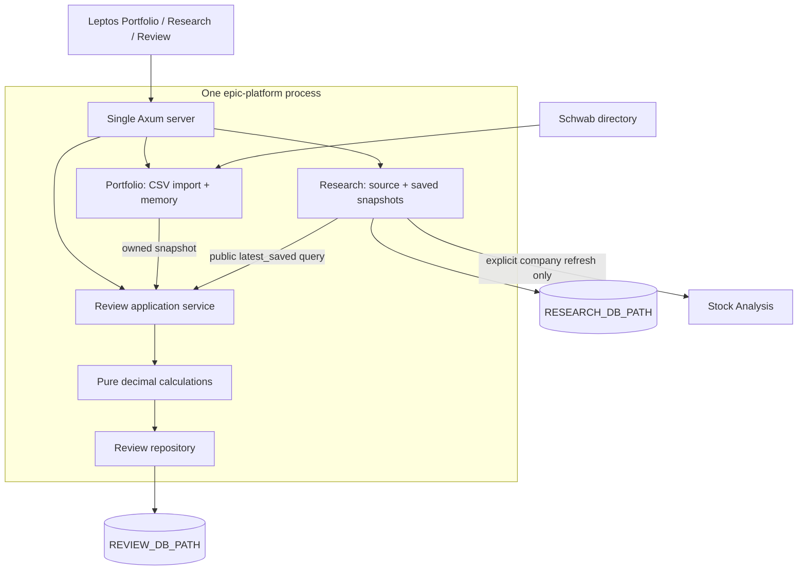

# Stage 04 — immutable portfolio reviews

## Purpose

Complete the first product loop: loaded holdings + saved research -> deterministic
review -> durable history -> factual comparison. EPIC remains one workspace,
one Linux process, one Axum server and one native Leptos application. Creation
is a synchronous HTTP operation, with no external retrieval or implicit reload.

Stage 3 proposed research-period comparison as a possible next step. This stage
implements the requested portfolio review instead. The actual Stage 3 database
is strictly Research-owned, and its records have SQLite IDs that were previously
private. Review therefore uses a new public saved-snapshot interface and owns a
separate database. Existing research storage is neither renamed nor relocated.



## Ownership and public interfaces

Portfolio owns parsing, instrument classification, current positions, source
filename, load time/status and the last good in-memory snapshot. Review calls
`PortfolioState::snapshot()` and receives an owned clone. No state guard escapes.
The directory path and raw CSV are not persisted in a review.

Research owns its source adapter, registry, database and snapshots. Its new
`ResearchService::latest_saved(symbols)` interface returns `SavedResearchSnapshot`
values with an ID and domain snapshot. Its repository makes one SELECT across
the requested companies' latest periods. SQLite gives that statement one
consistent read view, even if another request commits a refresh concurrently.
The query lives wholly in Research; Review executes no Research SQL and never
calls its refresh operation.

Review owns coordination, copied input records, calculations, coverage policy,
saved history and comparison. `review::service` brings existing modules together;
`domain` names the result, `calculations` performs pure arithmetic, and `repository`
owns Review SQL. Axum handlers stay in `server.rs`; presentation stays in
`pages/review.rs`. No generic workflow engine or provider traits were introduced.

The service is the right coordination point because creation spans several
module responsibilities. It must order public reads, distinguish partial
availability, perform calculations, and commit the resulting record. Portfolio
and Research remain independently usable and do not depend on Review.

## Input capture and immutability

Each saved `ReviewDocument` contains calculation version 1, creation time,
portfolio capture time, research-read completion time, portfolio load time/status,
source filename, summary metrics and all reviewed positions. Each position stores
the original symbol, normalized stock identity where available, description,
instrument type, quantity, signed market value and calculated portfolio weight.
Only fields needed for this review are copied; price, cost basis, full directory
paths and raw brokerage CSV contents are not persisted.

Covered positions contain the Research snapshot ID and a full copy of the small
Stage 3 domain snapshot: company identity, earnings period/end, revenue, diluted
EPS, currency, provider/retrieval dates, and source links. IDs identify provenance
within the originating research database; there is no cross-database foreign key
or lookup needed to display an old review. Renaming, replacing or losing that
database cannot cause a review to silently adopt newer research. Coverage status
and ages are captured with those facts.

Portfolio and Research are independent stores. Capture deliberately does not
claim to freeze them at one global instant: first clone Portfolio, then make one
consistent Research read. Both capture timestamps are stored. A subsequent reload
or research commit cannot change either owned input. Creation time marks input
assembly before calculation/save, and saved IDs order completed records.

A failed portfolio reload may leave a valid prior snapshot. Review accepts it,
preserves its successful load time and current Failed/Loading status, and displays
a warning. An absent, empty or inconsistent portfolio cannot create a review.

## Creation sequence and transaction

```mermaid
sequenceDiagram
    actor User
    participant UI as Leptos Review
    participant API as Axum
    participant Service as Review service
    participant Portfolio as Portfolio state
    participant Research as Research service
    participant Calc as Calculations
    participant DB as Review repository
    User->>UI: Create portfolio review
    UI->>API: POST /api/reviews
    API->>Service: create_portfolio_review
    Service->>Portfolio: snapshot()
    Portfolio-->>Service: Owned clone; read lock released
    Service->>Service: Validate portfolio; collect supported symbols
    Service->>Research: latest_saved(symbols)
    Research-->>Service: IDs + snapshots / explicit repository error
    Service->>Service: Copy research, status, dates and frozen ages
    Service->>Calc: summarize(owned positions)
    Calc-->>Service: Decimal weights, concentration and coverage
    Service->>DB: save(complete document)
    DB->>DB: BEGIN; INSERT complete JSON + summary; COMMIT
    DB-->>Service: Saved review with ID
    Service-->>API: SavedReview
    API-->>UI: 201 Created + Location + JSON
    UI->>API: GET /api/reviews/:id
    API-->>UI: Saved record + comparison to previous saved record
```

The SQLite transaction begins only in `ReviewRepository::save`, after all other
module reads and calculations. One inserted row contains the complete document,
with a small summary projection for history. Commit precedes the successful
response. If insertion/commit fails, the transaction rolls back and no partial
review is returned as saved. An offline test forces an AFTER INSERT failure to
exercise rollback after a write has begun.

No portfolio lock is held during Research reads or Review writes. No Research
transaction or shared-state guard is carried into Review's transaction. A test
blocks Review's writer while a portfolio reload acquires its own write lock and
finishes. Source requests are absent from this path, also asserted by a mock
server test. The saved review is returned during the request; there are no job
states, queues, automatic retries or background execution. If the client loses
the response after commit, the record remains in history; inspect history before
creating another one. Request idempotency is outside this stage.

## Storage and migrations

`REVIEW_DB_PATH` defaults centrally in AppConfig to `data/reviews.db`, relative to
the server working directory. It must be separate from `RESEARCH_DB_PATH`.
Review creates missing parent directories/files and applies its own SQLx
versioned migrations from `src/review/migrations`. The build script tracks both
modules' migration directories. The existing Research migration is unchanged.

Migration 1 creates `reviews` with an autoincrement identity, creation timestamp,
summary JSON and complete document JSON. JSON validity is constrained in SQLite.
Triggers reject UPDATE and DELETE: the repository exposes insert/read only.
History queries select identity, timestamp and summary without loading positions
or research bodies. History and the immediately previous review use descending
saved ID, providing deterministic ordering even for equal timestamps or a clock
adjustment. There is no history pagination in this small local slice.

Review's database now contains historical holding values, so it contains personal
portfolio data even though Research's database contains only public research.
Database files and WAL/SHM companions are ignored by Git. All verification uses
temporary databases and invented holdings. Initialization/migration failures are
logged and exposed only in Review; Portfolio, Research and health still start.

## Deterministic calculations (version 1)

All money and ratios use `rust_decimal::Decimal`. Checked sums, differences,
division and multiplication return a typed calculation error on overflow.
Ratios are saved rounded to six decimal places using Decimal's default rounding;
the page displays two. Undefined denominators are `null`, displayed as N/A.

| Metric | Definition |
| --- | --- |
| Total exported value | Sum of signed market values, including cash and shorts; checked against Portfolio's summary |
| Position count | Exported holding rows, including cash/unsupported instruments |
| Position weight | Signed value / signed total × 100, only when total is positive |
| Gross value | Sum of absolute values across all positions |
| Largest position | Greatest absolute value; original symbol breaks ties deterministically |
| Top-three concentration | Sum of the three greatest absolute values / gross value × 100; all positions participate |
| Supported count | Ordinary equities whose normalized symbol is in the Stage 3 registry |
| Covered count | Supported positions with a captured research snapshot |
| Count coverage | Covered count / supported count × 100 |
| Value coverage | Absolute covered equity value / absolute supported equity value × 100 |
| Snapshot age | Signed whole seconds from retrieval time to review creation time |
| Provider age | Signed whole seconds from source update time to review creation time |

Absolute values make concentration and coverage interpretable with short
positions rather than letting longs and shorts cancel. Signed weights can be
negative or exceed 100%; zero/negative net totals have no displayed weights.
Zero gross/supported denominators remain N/A, including an all-cash portfolio.
Counts are positions rather than unique companies; repeated normalized symbols
share copied research but retain separate position context.

No Stage 3 stale/fresh threshold exists. Exact ages in whole seconds are saved
and displayed without a stale judgment or recomputing relative to today's date.
A negative age honestly exposes a future provider timestamp or clock discrepancy.
No predictions, target prices, recommendations or generated conclusions occur.

## Coverage and failure policy

`available` means the exact research snapshot was copied. `missing` means a
registry-supported equity had no saved snapshot. `unmatched` means an ordinary
equity outside the registry. `unsupported` covers options, ETFs, cash and other
instruments rejected by the existing classifier. Unmatched and unsupported rows
remain visible, and are explicitly excluded from supported-equity coverage.

Missing all or some research is a valid review. If the Research repository read
fails, supported positions instead receive `repository_failure`, the Review
document retains the error, and coverage means successfully captured research
(zero in that failed batch). The page does not claim that Research was empty.
Because capture is a single consistent batch, a malformed selected research row
fails that batch rather than mixing trusted and unvalidated captures.

An existing review reads only Review storage; current portfolio or research
availability does not matter. A read error reports a Review repository failure.
A failure to read/compare the previous review does not hide the selected record;
it returns a separate comparison error.

## API and page

| Request | Result |
| --- | --- |
| `POST /api/reviews` | 201 with SavedReview and Location; captures current memory + saved research only |
| `GET /api/reviews` | 200 with lightweight history entries, newest saved first |
| `GET /api/reviews/{id}` | 200 with ReviewDetail: immutable review, optional comparison and comparison error |

Errors have `{error: {kind: ...}, message: ...}`: no portfolio is 409, empty or
inconsistent portfolio 422, missing review 404, invalid/nonpositive ID 400,
repository/init/migration failure 503, calculation failure 500. The app preserves
its existing `Cache-Control: no-store` behavior. Requests accept no filesystem
path or source-fetch instructions.

The initial Leptos page renders history and the latest record on the server,
serializes them for hydration, and offers create/select controls in the browser.
Creating adds the returned saved entry to history and then loads its comparison.
Opening another review reads that saved ID. A selection/create error keeps the
previously displayed record. All browser requests go to the same EPIC server.
The page presents covered, missing, unmatched and unsupported groups separately,
with preserved source links, snapshot dates and frozen ages.

Comparison uses the immediately preceding saved ID, even when opening an older
review. It compares stored totals/counts/largest symbols/concentration/coverage
and sorted added/removed symbol sets. Ordinary symbols use StockSymbol identity;
unsupported symbols retain trimmed broker identity with no option inference.
Undefined previous ratios remain N/A. These are record differences, not returns:
there is no cash-flow adjustment, performance attribution or investment conclusion.

## Verification completed

Stage 4 verification used synthetic holdings and temporary research/review
databases, not private Schwab data or a live research provider.

- Formatting, native SSR Clippy and WebAssembly hydrate Clippy passed.
- All 34 tests passed, including the existing portfolio and research tests.
- `cargo leptos build` built both the Axum server and hydrated Leptos client.
- Live HTTP and headless Firefox checks exercised health, Portfolio reload,
  Research display, review creation, history selection and comparison.
- After changing portfolio values/symbols and saving a newer research period,
  the first review's serialized content remained identical, including its original
  research snapshot identifier, dates and source links. A second review captured
  the new inputs and reported the factual differences.
- Restarting with the same temporary database paths preserved both reviews.
- With the portfolio directory missing and Research initialization deliberately
  failing, existing reviews still rendered and were retrievable; new review
  creation returned the structured no-portfolio error. Health remained available.
- Automated tests additionally exercise transaction rollback, immutable-table
  guards, migration failures, missing/partial coverage and releasing the portfolio
  lock while a database write is blocked.

## Reading order

1. `src/review/domain.rs`: copied inputs, summaries, errors and API contracts.
2. `src/review/calculations.rs`: exact definitions and comparison.
3. `src/research/service.rs::latest_saved` and its repository query: public read boundary.
4. `src/review/migrations/0001_reviews.sql` and `repository.rs`: immutable storage and transaction.
5. `src/review/service.rs`: orchestration and failure policy.
6. `src/config.rs`, `main.rs`, `state.rs`, `server.rs`: wiring and routes.
7. `src/pages/review.rs`: UI and browser requests.
8. `tests/review.rs`: reproducibility, rollback, coverage and API examples.

## Deferred to Stage 5

The best next goal is durable background execution for an explicit user-triggered
research refresh: persist the operation and its outcome so a process restart or
closed browser does not lose its status. That is not implemented here. Stage 4
also excludes scheduling, automatic reload/refresh, concurrent research refresh,
cancellation, retries/circuit breakers, authentication, notifications, AI analysis,
brokerage APIs, workflow engines and deployment infrastructure.
