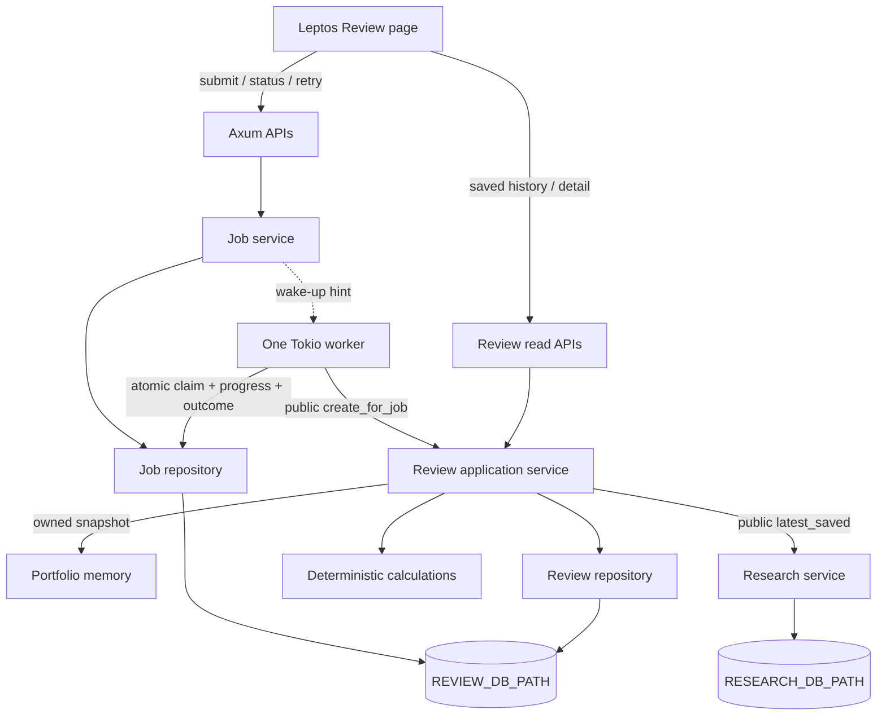

# Stage 05 — durable portfolio review jobs

This document records Stage 5. [Stage 6](architecture-stage-06.md) adds Watchlist
Briefing (not the research-refresh workflow suggested below) to the same runner.
Migration 3 scopes idempotency by kind and normalized input, adds durable inputs
and typed briefing results, and preserves existing Review jobs. Polling now lives
in shared `pages/job_panel.rs`; job logs use `result_id` for both workflows.

## Purpose and scope

Move review execution out of the originating HTTP request while keeping one
Rust workspace, Linux process, Axum server and Leptos app. A durable command now
has its own identity, state, attempts, progress and result. Browser lifetime is
independent of execution lifetime. Stage 4 suggested background research refresh;
this stage follows the requested PortfolioReview workflow instead. Research
refresh remains its explicit synchronous Stage 3 operation.



## Ownership and input timing

Jobs owns the queue, transition rules, worker lifecycle and retry. Review owns
input capture, calculation, immutable documents and history. Portfolio owns its
in-memory state and CSV import. Research owns its independent database/source.
Jobs calls public Review methods; it never queries Research or Review tables.
Review reports `ReviewStep` through an async callback and accepts an optional
origin ID without depending on the Job module.

The actual Stage 4 database was strictly Review-owned. It now serves as the
Review execution database: Review owns `reviews`; Jobs owns `jobs` and
`job_failures`. `ReviewService::execution_pool()` explicitly supplies a cloned
SQLx pool to JobRepository. One migration ledger stays in `src/review/migrations`.
Migration 2 adds Jobs tables plus Review's nullable unique `origin_job_id`;
migration 1 and existing documents are unchanged. No new path, relocation, or
Research schema access is introduced. Startup runs migrations once before worker
startup; Jobs does not run a competing migration ledger.

Submission validates that a usable portfolio exists. It persists a command, not
a portfolio payload. The worker captures current portfolio/research inputs when
execution begins, preserving Stage 4 capture/load timestamps. Reloading holdings
while a job waits can therefore affect its future review. Manual retry without a
committed result also uses then-current inputs. This is explicit on the page.
Already-saved reviews remain immutable. Portfolio locks end when the owned
snapshot is returned, before progress updates, research reads or review writes.

## Submission, idempotency and polling

```mermaid
sequenceDiagram
    actor User
    participant UI as Leptos
    participant API as Axum
    participant Jobs as Job service/repository
    participant DB as Execution SQLite
    participant Worker as Tokio worker
    participant Review as Review service
    User->>UI: Create portfolio review
    UI->>API: POST /api/reviews + Idempotency-Key
    API->>Jobs: Validate current portfolio; submit
    Jobs->>DB: INSERT queued (unique key), commit
    Jobs-->>Worker: Notify (optional wake-up hint)
    Jobs-->>API: Job identity/current status
    API-->>UI: 202 + Location /api/jobs/id
    Worker->>DB: Atomic UPDATE oldest queued -> running RETURNING id
    Worker->>Review: create_for_job(job_id, progress callback)
    Review->>DB: Report real progress boundaries through Jobs
    Review->>Review: Capture inputs; load saved research; calculate
    Review->>DB: BEGIN; insert immutable review + unique origin job; COMMIT
    Review-->>Worker: Saved review ID
    Worker->>DB: Mark succeeded + result ID + completion time
    loop Every 2 seconds while active
        UI->>API: GET /api/jobs/id
        API->>DB: Read persisted state
        API-->>UI: State/step/times/error/result
    end
    UI->>API: GET /api/reviews/result_id
    API-->>UI: Immutable review + comparison
```

202 acknowledges durable acceptance, not a completed review. The body is
`{job_id,status,status_url}` and Location points to the job. A repeated key returns
202 and the existing identity/current status, even if the job already completed
or current portfolio/worker is unavailable. Keys contain 1–128 ASCII letters,
digits, dots, underscores or hyphens; uniqueness spans this database's lifetime.
The SQLite UNIQUE constraint handles concurrent duplicate requests. NULL keys
create separate jobs. Keys are not logged or exposed in status responses.

The client generates one UUID per intentional action, disables submission while
the request is in progress, and retains the key after a failed request so a
repeat submission can recover the same job. A browser reload restores the latest
30 jobs from the server. Active jobs are polled every two seconds, with network
errors shown and status reads resumed while active. Terminal jobs stop polling;
succeeded jobs open their saved result. History remains independently selectable.
Closing the page disposes its polling state; it does not cancel the job. Jobs
submitted from another tab appear when this page is reopened. No local browser
state is the authoritative record.

## State machine and atomic claims

```mermaid
stateDiagram-v2
    [*] --> Queued: Persist submission
    Queued --> Running: Atomic claim; attempt + 1
    Running --> Succeeded: Saved review ID
    Running --> Failed: Sanitized execution error
    Running --> Interrupted: Startup found no committed review
    Failed --> Queued: Manual retry
    Interrupted --> Queued: Manual retry
```



`jobs` stores identity, closed kind enum (`PortfolioReview`), status, creation and
queue timestamps, start/completion timestamps, attempt count, progress, safe
error, result ID and optional idempotency key. API result references are typed
`{type:"review",id:...}`. `job_failures` preserves prior attempt status, step,
start/end and safe error in the same transaction that records failure/interruption.

Claiming is a single SQLite UPDATE selecting the oldest queued row by queue
timestamp then ID, changing status to Running and incrementing attempt count,
with RETURNING. SQLite's writer serialization prevents two callers from claiming
the same queued row. Queue timestamps use fixed-precision UTC strings. Retry
receives a new queue timestamp, joining the back of the queue. All active writes
check both running status and attempt number; stale attempts cannot complete a
retried job. Progress also checks its prior step. Invalid transitions return 409.

Attempts count actual execution starts: initially queued is attempt 0, first
claim is 1. Retry preserves the identity and history, clears active timestamps
and error, queues it, and the next claim increments the count. This is an explicit
refinement of “increase on retry”: waiting retries do not pretend to have run.
There is no automatic retry. A second intentional review gets a new job/key.

## Worker and progress

One Tokio task claims one job at a time. It calls Review, whose callback persists
`snapshotting_portfolio`, `loading_research`, `calculating_review` and
`persisting_review`; success records `completed`. Steps indicate entry into real
work, with no numeric percentage estimates. Missing research remains valid
partial coverage under Stage 4 rules. Ordinary review failure records Failed and
the worker continues with later queued jobs. Task panic becomes a sanitized
failure; an ambiguous Review persistence error first checks for a committed result.

Tokio Notify reduces latency but never carries the queue. The worker also checks
every five seconds, so a missed notification cannot lose a job. Startup checks
queued work without waiting for notification. If the queue cannot record a state
transition, the worker stops and readiness becomes false; it does not claim more
work with uncertain execution state. Recovery after fixing storage requires restart.

`tracing` emits JSON. A job span has job_id, job_kind and attempt; events carry
state and current step, and terminal execution events include elapsed_ms and
result_review_id on success. Submission, manual retry, reconciliation, worker
failure and shutdown are logged. `RUST_LOG=epic_platform=info` is the default.
User-facing errors come from closed domain errors; SQL, private filenames,
arbitrary panic text and backtraces are not copied into jobs.

## Crash windows and result idempotency

| Interruption point | Restart behavior |
| --- | --- |
| Before queue INSERT commits | No accepted job; repeat with the same key |
| After queue commit, before response/Notify | Queued row survives; repeated key finds it; worker scans it |
| After atomic claim, before Review commit | Running row becomes Interrupted if no origin review exists; explicit retry required |
| During Review transaction | Transaction commits completely or rolls back; recovery checks which occurred |
| After Review commit, before job success update | Find review by origin_job_id and mark Succeeded with its existing ID |
| After job success | Job and immutable review remain readable |

Startup reconciles abandoned Running rows through `ReviewService::by_origin_job`.
If the read fails, it does not guess that work was interrupted: worker startup
fails, readiness stays false and Running remains for later recovery.

Review first returns any existing origin result before reading current inputs.
Its insert transaction uses a UNIQUE origin_job_id index plus conflict handling;
even racing executions can save only one review for a job. A conflict returns
the existing document rather than computed replacement inputs. The review
transaction and job-success update are deliberately separate, and the origin
link closes that crash window. This guarantees one persisted result per job,
not that calculation instructions can never run twice. Stage 4 reviews have NULL
origin and preserve their existing IDs/documents and immutability triggers.

## Startup, readiness and shutdown

Startup opens Research and Review, runs migrations, loads Portfolio, binds the
HTTP address, reconciles Jobs, then starts the worker and serves HTTP. Binding
before worker startup prevents a second process on the same address from
reconciling the live one's work. Only one application process may use a given
execution database, including when choosing a different port. Multi-process
leases and distributed ownership are out of scope.

`/health` is lightweight liveness: the process can answer HTTP. `/ready` returns
200 only if required Research/Review migrations succeeded, the Job table can be
queried, and the worker is available. Otherwise it returns 503 and three booleans
explaining which condition failed. External source availability and portfolio
loading do not gate readiness. Initialization errors remain isolated so Portfolio,
Research where available, and saved-review reads can continue.

Ctrl+C/SIGTERM tells the worker to stop claiming jobs. An already-started claim or
active execution gets up to five seconds to finish; then its task is dropped.
The child execution is owned by a JoinSet, so it is aborted with its parent rather
than detached. Any remaining Running state is reconciled next startup, including
SQLite commits that may finish around cancellation. Queued work remains in SQLite.
Axum graceful shutdown follows the worker drain; ordinary pre-existing HTTP
requests retain Axum's normal graceful completion behavior.

## API and failure contract

Review GET routes are unchanged. POST /api/reviews is the intentional incompatible
change from Stage 4's 201 SavedReview to 202 JobSubmission.

| Route | Successful response |
| --- | --- |
| POST /api/reviews | 202, Location, JobSubmission |
| GET /api/jobs | 200, newest 30 jobs |
| GET /api/jobs/{id} | 200, state/step/attempts/times/errors/result/history |
| POST /api/jobs/{id}/retry | 202, same ID and status URL |
| GET /api/reviews | Existing lightweight saved history |
| GET /api/reviews/{id} | Existing immutable detail + comparison |

Errors have `{error:{kind:...},message:...}`. Invalid ID/key is 400, missing job
404, missing portfolio or invalid retry state 409, invalid portfolio 422, and
repository/worker unavailability 503. Execution failures are stored on jobs, not
returned as an error to the completed submission request. No source refresh,
filesystem reload, or calculations occur in the submission handler.

## Verification completed

- The baseline's 34 tests and native/browser checks passed before editing.
- All 49 tests now pass, including 15 Job tests and preserved Stage 1–4 coverage.
  Formatting, SSR/hydrate Clippy with warnings denied, and `cargo leptos build`
  also pass. A migration test upgrades a real Stage 4 schema without changing its
  saved review document.
- Live API checks used synthetic holdings and isolated databases. Actual process
  termination during a claim left a durable queued job that executed on restart.
  Termination before Review commit produced Interrupted; manual retry succeeded.
  Termination after Review commit but before Job success recovered the original
  review ID, with exactly one review for that job.
- A deliberately rejected review insert produced a sanitized Failed job. Manual
  retry kept its identity, incremented its execution attempt and retained failure
  history. Restart preserved completed jobs and review history. Structured logs
  included job identity, attempt, elapsed time and saved result identity.
- Headless Firefox verified submission, visible Running state, page reload during
  execution, resumed polling, automatic result display, failure and manual retry,
  previous-attempt details, Portfolio/Research navigation and opening old reviews.
  There were no browser console errors or external API requests. Repeated
  idempotency keys returned the same job and produced one review.
- Slow/failing SQLite triggers existed only in disposable verification databases;
  production code has no artificial execution delays or test-control endpoints.
- SIGTERM during a deliberately slow review stopped the process after about
  5.2 seconds. The job record remained durable; restart correctly marked the
  abandoned running attempt Interrupted instead of inventing a successful result.

## Reading order and Stage 6

1. `src/jobs/domain.rs`: closed kinds, lifecycle, status and API models.
2. `src/review/migrations/0002_jobs.sql`: execution schema and result uniqueness.
3. `src/jobs/repository.rs`: durable transitions, claim and history.
4. `src/review/repository.rs`, `service.rs`: origin lookup, insert and progress.
5. `src/jobs/service.rs`: submission keys, admission and manual retry.
6. `src/jobs/runner.rs`: execution, recovery and shutdown.
7. `src/main.rs`, `state.rs`, `server.rs`: startup, shared handles and HTTP.
8. `src/pages/review.rs`, `tests/jobs.rs`: polling and failure examples.

Stage 5 teaches durable execution with recoverable state transitions and an
idempotent result boundary. The best Stage 6 goal is to add an explicit
single-company research refresh job using this runtime. Queue identity, claims,
attempts, tracing, polling, readiness and shutdown can be reused; provider-specific
result/recovery policy must be designed deliberately. That workflow is not added.

Out of scope: multiple worker processes, queue services, automatic retry,
cancellation, priorities, scheduling, automatic reload/refresh, concurrent company
refresh, WebSockets/SSE, telemetry infrastructure, AI analysis, authentication,
deployment infrastructure, dynamic plugins and visual redesign.
