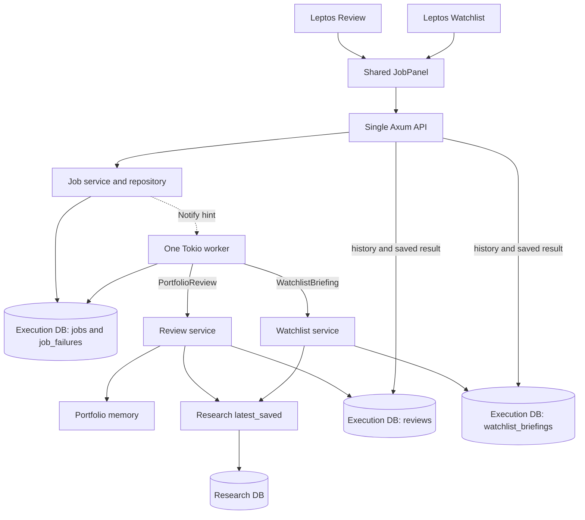

# Stage 06 — one durable runtime, two workflows

## Purpose and stopping point

Watchlist Briefing is the second useful workflow and the capstone of the core
platform roadmap. It proves that durable submission, claims, progress, retries,
recovery and result inspection are not specific to portfolio reviews. This is
still one Rust workspace, one Linux process, one Axum server and one Leptos app.
There is no second runner, queue service, plugin system or workflow engine.

The inspected Stage 5 baseline passed formatting, native/browser Clippy and all
49 tests. Its worker already dispatched a closed JobKind enum, but its result
lookup, progress, key uniqueness and browser component assumed Review. Those
are the narrow adaptation points. Stage 5's proposed next workflow was research
refresh; this stage deliberately implements the requested **saved-research
Watchlist Briefing** instead. Manual source refresh remains separate and synchronous.

## Two workflows and ownership

| Workflow | Captured inputs | Immutable output |
| --- | --- | --- |
| PortfolioReview | Current portfolio and latest saved research when executed | Existing review, positions, metrics, coverage, provenance |
| WatchlistBriefing | Normalized configured symbols at submission; latest saved research when executed | One entry per symbol, copied research facts/dates/links and research IDs |

Portfolio owns CSV import and in-memory holdings. Research owns source retrieval,
normalization, registry and its independent SQLite database. Review owns its
calculations and documents. Watchlist owns input validation, briefing assembly
and saved briefing records. Jobs owns submission identity, queue state, attempts,
progress, worker lifecycle and recovery dispatch. No workflow queries Research's
private tables; both call `ResearchService::latest_saved`, whose single SELECT
reads a consistent set of latest saved earnings periods.



## Configuration and normalized input

`AppConfig::from_env` reads `WATCHLIST_SYMBOLS` once on startup. Unset/blank means
an empty watchlist, not an implicit portfolio watchlist. Up to 32 comma-separated
entries are accepted. Each uses the shared `StockSymbol`: whitespace trimmed,
ASCII uppercase letters, optionally a single dot/dash share-class separator.
Empty comma entries, option-style strings, malformed symbols and an oversized
list reject the whole configuration with a safe error. Valid symbols are sorted
and deduplicated. The canonical `WatchlistInput` also validates on deserialization.

Configuration is a user-declared list of ordinary equities, not a security-master
lookup: syntax alone cannot identify ETFs or confirm an unknown ticker exists.
There is no ETF expansion, option inference, alias or fuzzy match. A syntactically
valid symbol without saved research remains **Never refreshed**, even outside
the small Research registry; its company name is unknown and no discovery occurs.
Registry membership does not gate the briefing. Research's existing refresh API
still rejects symbols it does not support.

`GET /api/watchlist` returns normalized input and any configuration error. Empty
or invalid configuration prevents new briefing submissions (422) but does not
break other pages, readiness, saved results, or previously queued valid inputs.
Changing the environment requires restart; it affects only new submissions.

## Durable identity and database migration

The Stage 5 execution database remains at `REVIEW_DB_PATH`, default
`data/reviews.db`. Watchlist owns only `watchlist_briefings`; Review still owns
`reviews`; Jobs still owns `jobs` and `job_failures`. They share the existing pool
and migration ledger at `src/review/migrations`. The historically named path and
ledger are not silently renamed. Research remains at `RESEARCH_DB_PATH`.

Migration 3 transactionally rebuilds the closed Jobs table to accept the second
kind and a canonical `input_json`. It copies IDs, states, timestamps, attempts,
errors, result IDs and keys, and copies/reconnects the child failure table before
replacing the old tables. Existing Review documents and migrations are untouched.
Legacy jobs receive `{"type":"portfolio_review"}` input, preserving their
execute-time capture semantics and existing idempotency keys.

The uniqueness constraint becomes `(kind, input_json, idempotency_key)`:

- A repeated key with the same workflow and canonical input returns the same job.
- Reordered/duplicated/case-varied versions of the same watchlist are identical.
- A different normalized list or workflow is a different request, even with the
  same key. Keys without an explicit value remain separate intentional jobs.
- Review has no submitted payload: its canonical input is the PortfolioReview
  marker, not a hash of mutable portfolio/research. Stage 5 behavior is preserved.

The response remains 202 plus `{job_id,status,status_url}` and Location. New
briefing submission has no body: the server captures its configured list. That
list is visible in job inspection, persists across restart, and is reused on
manual retry. If configuration changed after a lost response, inspect the old
job/history rather than assuming the same key refers to the new list.

## Submission, execution and snapshot meaning

```mermaid
sequenceDiagram
    participant UI as Watchlist / shared JobPanel
    participant API as Axum
    participant Jobs as Job service / SQLite queue
    participant Worker as One Tokio worker
    participant WL as Watchlist service
    participant Research as Research service
    participant DB as Briefing repository
    UI->>API: POST /api/watchlist/briefings + Idempotency-Key
    API->>Jobs: Validate configured list; persist normalized input + Queued
    Jobs-->>API: Job ID (commit complete)
    API-->>UI: 202 Accepted + Location
    Jobs-->>Worker: Wake-up hint
    Worker->>Jobs: Atomically claim oldest Queued; Running; attempt + 1
    Worker->>WL: create_for_job(input, job ID, progress callback)
    WL->>DB: Return existing origin result if present
    WL->>Jobs: reading_watchlist / loading_research via callback
    WL->>Research: latest_saved(normalized symbols)
    Research-->>WL: Exact saved IDs and snapshots
    WL->>WL: Copy facts; retain missing symbols as Never refreshed
    WL->>Jobs: persisting_briefing via callback
    WL->>DB: BEGIN; insert complete document with unique origin_job_id; COMMIT
    DB-->>Worker: Saved briefing ID
    Worker->>Jobs: Succeeded + typed result reference
    UI->>API: GET /api/jobs/id every 2 seconds while active
    API-->>UI: Status, step, times, errors and result
    UI->>API: GET /api/watchlist/briefings/result_id
    API-->>UI: Immutable saved briefing
```

No portfolio dependency or portfolio lock exists in this workflow. No network
source client is called. Research is read before the short write transaction.
The briefing copies each exact `SavedResearchSnapshot`: stable ID plus company,
period, Decimal revenue/EPS, currency, source timestamp, retrieval timestamp and
original source links. Its own creation timestamp is separate from those dates.
Missing symbols retain their normalized identity and explicit status.

One complete document and lightweight history metadata are inserted together.
A unique origin job ID returns an existing document on repeated execution, even
if research or configuration has changed. Database triggers prohibit update and
delete. Saved reads use only the briefing repository; they never join to current
research. Snapshot IDs express provenance across databases, not cross-database
foreign keys. Copied facts make history independently readable and immutable.

## Shared runtime and workflow-specific behavior

The worker's claim loop, FIFO order, notification/5-second queue scan, panic
containment, attempt checks, sanitized failures, manual retry, five-second
shutdown grace and readiness are unchanged. There is one explicit dispatch for
execution and one for saved-origin lookup. JobService composes the Watchlist
service from the existing execution pool and startup input; domain assembly and
SQL remain in Watchlist, not in the runner.

Progress paths are closed and kind-checked:

- Review: snapshotting_portfolio → loading_research → calculating_review →
  persisting_review → completed.
- Briefing: reading_watchlist → loading_research → persisting_briefing → completed.

Result references are `{type:"review",id:...}` or
`{type:"watchlist_briefing",id:...}`. Completion checks kind as well as attempt
and running state; a Review result cannot complete a Briefing job. Logs include
job_id, job_kind, attempt, state, step and elapsed_ms; `result_id` replaces the
Review-specific result_review_id field so both workflows use the same vocabulary.

Startup reconciles each abandoned Running job using its workflow's origin lookup.
An existing result becomes Succeeded; no result becomes Interrupted and requires
manual retry. A lookup error leaves Running and prevents worker startup rather
than guessing. This closes the crash window **after result commit but before job
success update** for both workflows. Queued jobs remain queued and execute after
startup. Retry preserves the job and its symbols but reads then-latest saved
research if no result exists. No automatic retries were added.

Research read errors fail a briefing rather than masquerading as Never refreshed.
Write failure leaves no partial result. Previously saved briefings remain available.
Review retains its Stage 4 policy of recording research repository failure as
unavailable coverage in a saved review; these policies are intentionally
workflow-specific, not forced into the common runner.

## API and presentation

| Route | Behavior |
| --- | --- |
| GET /api/watchlist | Normalized server configuration / error |
| POST /api/watchlist/briefings | 202 queued job; 422 empty/invalid configuration |
| GET /api/watchlist/briefings | Lightweight saved history, newest ID first |
| GET /api/watchlist/briefings/{id} | Immutable result; 400 invalid ID, 404 absent, 503 storage failure |
| GET /api/jobs?kind=watchlist_briefing | Up to 30 jobs of this kind |
| GET /api/jobs?kind=portfolio_review | Up to 30 Review jobs |
| GET /api/jobs/{id} | Shared inspection including durable input and typed result |
| POST /api/jobs/{id}/retry | Existing eligible-state retry contract |

Unfiltered GET /api/jobs retains its newest-30 behavior. Per-kind filtering avoids
one workflow crowding the other's recent list out. The native `/watchlist` page
shows configuration, safe errors, job feedback, history, immutable research and
source links. Both pages use `pages/job_panel.rs` for submission keys, polling,
retry and diagnostics. Typed result callbacks open the correct workflow's result;
browser refresh recovers jobs from SQLite. Closing a page only stops its polling.
All browser API requests target EPIC. SQLite, configuration and network source
code remain SSR-only and are absent from the WebAssembly build.

## Reading order

1. `src/jobs/domain.rs`: two closed input/kind/result variants.
2. `src/watchlist/domain.rs`, `src/config.rs`: normalization and configuration.
3. `src/review/migrations/0003_watchlist.sql`, `src/jobs/repository.rs`: migration,
   scoped identity, atomic claims and kind-checked progress/completion.
4. `src/jobs/service.rs`: admission and durable submission.
5. `src/jobs/runner.rs`: shared lifecycle and the two explicit dispatch points.
6. `src/watchlist/service.rs`, `repository.rs`: saved-research assembly and commit.
7. `src/server.rs`, `src/pages/job_panel.rs`, `src/pages/watchlist.rs`: HTTP/UI.
8. `tests/watchlist.rs` and preserved `tests/jobs.rs`: failure and recovery examples.

## Verification

- Formatting, SSR/hydrate Clippy with warnings denied, the full offline test suite,
  and `cargo leptos build` pass. Existing Stage 1–5 tests are preserved.
- New tests cover no-portfolio execution, canonical/empty/invalid inputs, missing
  research, copied snapshot immutability, scoped keys, both workflows in one
  worker, rollback, failure/retry, kind-checked progress/results, restart and
  committed/abandoned recovery. A real Stage 5 schema is migrated with legacy
  job IDs, keys and failure history preserved.
- A built server on an isolated local port used synthetic holdings and disposable
  databases. Headless Firefox verified Running state, reload during execution,
  resumed polling, saved facts/source links, sanitized failure, manual retry,
  older briefing selection, and Portfolio/Research/Review navigation. There
  were no browser errors or browser requests to external services.
- Real process restart preserved jobs, Review history and briefing documents.
  Queued inputs survived changed configuration and an unavailable portfolio.
  Seeded abandoned Running state became Interrupted and manual retry succeeded.
- A disposable SQLite trigger delayed the job-success update after briefing
  commit. SIGKILL in that window followed by restart recovered the original
  result ID with exactly one briefing for the job. No delay/test-control code
  was added to the application. No private files or production databases were used.
- Live research-provider refresh was deliberately not exercised: this workflow
  is saved-data-only, and the existing source behavior is covered by offline tests.

## What the second workflow taught

Reusable infrastructure is a small set of durable guarantees, not a generic
orchestration language. Stage 5's lifecycle reused cleanly; identity, immutable
inputs, typed results and recovery needed explicit workflow semantics. Those
semantics are now visible rather than hidden behind Review-specific assumptions.

The core roadmap stops here: local inputs → saved research → two useful workflows
→ durable inspectable execution → immutable history. Future features should be
chosen from actual use, not from a presumed next stage. A possible small naming
cleanup is moving the shared execution migration ledger out of the historically
named Review directory; no database relocation or such refactor is needed now.

Out of scope: AI analysis/recommendations, automatic or scheduled refresh,
live brokerage integration, authentication, deployment infrastructure,
distributed/multiple workers, automatic retry, cancellation, workflow engines,
and broad visual redesign.
